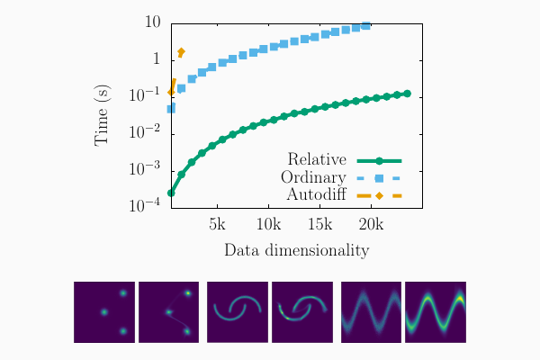

# Relative gradient optimization of the Jacobian term in unsupervised deep learning

Reference implementation for the paper *Relative gradient optimization of the Jacobian term in unsupervised deep learning*
* [https://arxiv.org/abs/2006.15090](https://arxiv.org/abs/2006.15090)

A simple training example over the MNIST dataset is found in the following notebook: [mnist_training.ipynb](mnist_training.ipynb).



To reproduce the results reported in the paper, see below.

## Requirements

#### Packages
To install required python packages:

```setup
pip install -r requirements.txt
```

#### Datasets

MNIST and CIFAR are automatically downloaded when needed.

To download and setup the needed UCI datasets, follow the instructions in https://github.com/gpapamak/maf#how-to-get-the-datasets and put the individual datasets folders inside `experiments/storage`.

## Training

To train the model in the paper, run the command:

```train
$ cd experiments
$ python train.py <args>
```

Here is the full list of optional arguments:

```
--epochs           number of epochs of training
--batch_size       size of the batches
--lr               adam: learning rate
--log_every        interval between logs
--seed             random generator seed
--dataset          one among: MNIST | CIFAR | POWER | GAS | HEPMASS | MINIBOONE | BSDS300 | TOY
--toy_name         one among: sine | moons | smile | 2spirals | checkerboard | rings | trimodal
--num_layers       define a model with `num_layers - 1` linear layers and 1 final affine layer
--nonlinearity     nonlinear activation function
--alpha"           angular coefficient for the left side of RELU-type activation functions
--look_ahead       stop training if no improvement has been observed for `look_ahead` epochs
--log_dir          directory in which to save the model (ending in '/')
--bias             whether to include the bias in the linear layers or not
--trick            whether to apply the relative trick to the gradients or not
--generation       whether to perform data generation during training

```

#### Examples

To train the model over the MNIST dataset specifying a set of hyperparameters, run:

```
$ python train.py --dataset MNIST
                  --log_dir mnist_run1/
                  --batch_size 10
                  --lr 1e-4
                  --bias True
                  --num_layers 2
```

To train over the `sine` toy distribution:

```
$ python train.py --dataset TOY --toy_name sine
```

## Evaluation

To evaluate a trained model, run:

```eval
$ cd experiments
$ python eval.py --dataset MNIST --log_dir mnist_run1/
Test set evaluation: -1375.2 +- 1.4
```

## Results

Our model achieves the following performance for the density estimation task on the tested datasets:

| POWER | GAS | HEPMASS | MINIBOONE | BSDS300 | MNIST |
| -------------- | -------------- | ---------------- | ---------------- | -------------- | -------------- |
| 0.065 +- 0.013 | 6.978 +- 0.020 | -21.958 +- 0.019 | -13.372 +- 0.450 | 151.12 +- 0.28 | -1375.2 +- 1.4 |
